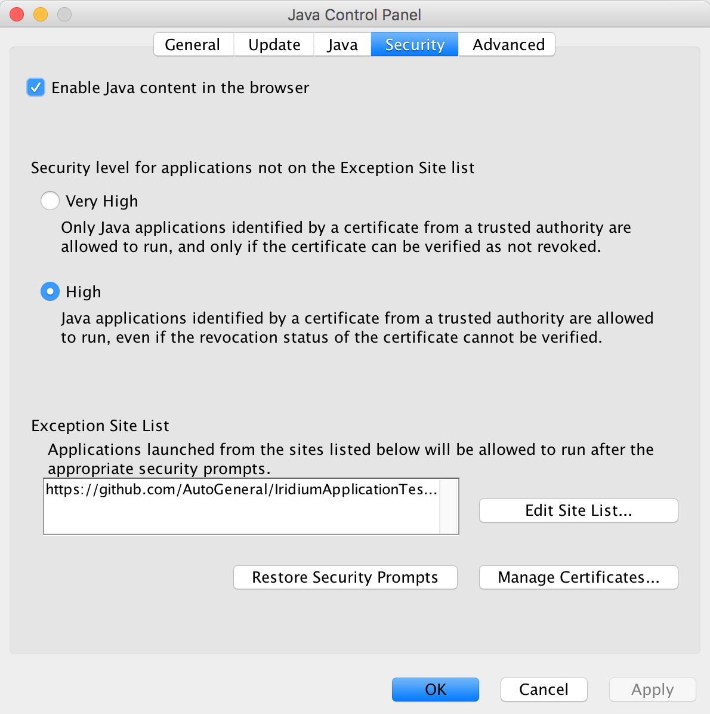

# Installation

## Prerequisites
Iridium is written against Java 8, which must be available on your PC before you can run the application.

## Configuring Java
To run the Java Web Start examples, you must add the GitHub URL `https://github.com/AutoGeneral/IridiumApplicationTesting/releases/download/` to the Exception Site List, which can be found in the Java Control Panel under the Security tab. This is because the JAR file has a self signed certificate applied to it, and Java will not let you run the application without trusting the source.

