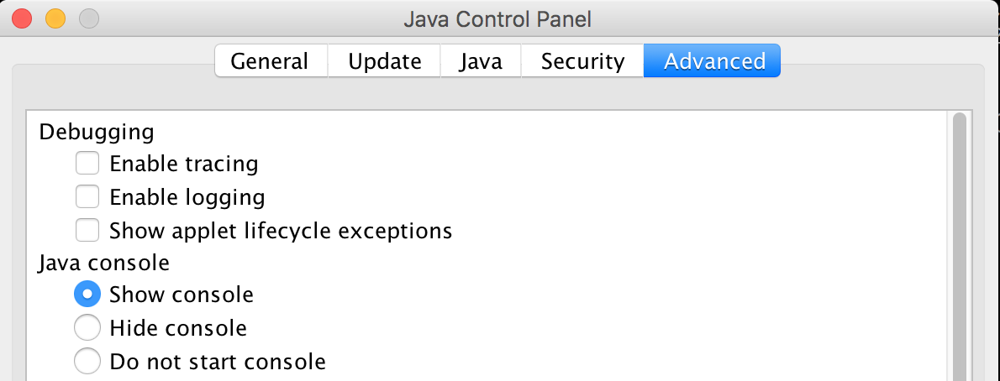

# Installation

## Prerequisites
Iridium is written against Java 8, which must be available on your PC before you can run the application.

## Configuring Java
To run the Java Web Start examples, you must add the GitHub URL `https://s3-ap-southeast-2.amazonaws.com/ag-iridium/` to the **Exception Site List**, which can be found in the Java Control Panel under the **Security** tab. This is because the JAR file has a self signed certificate applied to it, and Java will not let you run the application without trusting the source.

You will also want to enable the Web Start console. This gives you feedback on how the script is running.

Click the **Advanced** tab, and select the **Show Console** option.

## Windows Firewall

The first time you run the application in Windows, you may be prompted to allow it to access the network. Click the **Allow access** button if you see this prompt.

